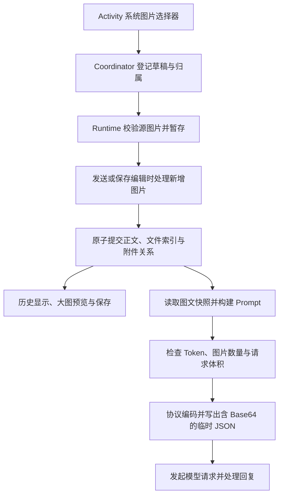

# 图片发送功能实现与维护指南

从 [ChatViewModel.kt](../app/src/main/java/me/kafuuneko/rpclient/feature/chat/ChatViewModel.kt) 的 `onSendMessage()` 开始阅读：**选图时暂存，发送或保存编辑时处理新增图片；入库成功后，历史显示与模型请求共用最终文件。**

> 实现基线：`6ea8ed9`，核对日期：2026-09-17。包含 `8c679bb` 的图片存储简化。本文依据源码、提交记录及已有测试代码整理；整理期间未运行编译、单元测试或仪器测试。全文阅读约 15–20 分钟。

## 阅读导航

- [整体架构与近期演进](#整体架构与近期演进)：先建立完整调用链。
- [从选图到消息提交](#从选图到消息提交)：理解校验、压缩和失败重试。
- [存储、编辑与显示](#存储编辑与显示)：理解文件归属、事务与清理。
- [Prompt 与模型请求](#prompt-与模型请求)：理解预算、群聊和三种协议。
- [维护入口与验证](#维护入口与验证)：定位改动位置和相关测试。

## 整体架构与近期演进

### 当前实现的核心行为

图片发送通过多模态内容块，将图片字节以 Base64 嵌入模型请求。当前链路没有独立的图床上传接口，也不需要先获取远端图片 URL。



**最新版本只持久化最终图片。** 自动或自定义模式处理完成后，历史图片已经是压缩后的版本；修改压缩设置不会重新处理历史图片。

### 模块职责

| 层 | 核心组件 | 职责 |
| --- | --- | --- |
| 页面与业务编排 | `ChatActivity`、`ChatViewModel` 及群聊对应类 | 启动选择器、接收操作、提交消息、启动模型生成 |
| 图片交互状态 | `MessageImageCoordinator` | 草稿、历史编辑、排序、预览、选图归属与取消 |
| 图片处理 | `MessageImageRuntime` | 格式校验、压缩、解码、导出、准备请求引用 |
| 数据与文件 | `MessageImageRepository`、`FileRepository` | 附件关系、原子提交、去重、读取保护与回收 |
| Prompt 与协议 | Builder、`PromptRequestFinalizer`、`MultimodalWireCodec` | 图文组织、预算裁剪与协议编码 |

Compose 通过 `UiIntent` 交给 ViewModel 处理用户动作；系统选择器和保存文档对话框通过 `ViewEvent` 交给 Activity。页面不直接操作 DAO 或图片文件。

### 近期演进

| 时间与提交 | 主要变化 | 维护意义 |
| --- | --- | --- |
| 2026-09-09，`12406c2` | 初步实现图片发送 | 建立多模态链路 |
| 2026-09-14 至 2026-09-15 | 优化预算、编辑切换、取消、附件查询与图片保存 | 补强生命周期和竞态边界 |
| 2026-09-16，`50b456e`、`4ca827d` | 修复图文快照、选图归属和群聊预算；加入压缩策略 | 同次请求读取一致数据，图片处理可配置 |
| 2026-09-17，`8c679bb` | 简化存储与编辑 | 选图只暂存，提交时处理；历史和请求共用最终文件 |

部分类注释或测试名称仍使用“原图”一词。判断行为时应以当前调用链为准：压缩模式提交后的仓库文件是最终版本，不是另存的一份相册源图。

## 从选图到消息提交

### 打开系统选择器

源码入口：[ChatActivity.kt](../app/src/main/java/me/kafuuneko/rpclient/feature/chat/ChatActivity.kt)、[GroupChatActivity.kt](../app/src/main/java/me/kafuuneko/rpclient/feature/groupchat/GroupChatActivity.kt)。

```text
Compose 发出 Choose(editing)
    → ViewModel 调用 Coordinator.choose(editing)
    → ViewEvent 通知 Activity
    → 系统图片选择器
    → Picked(uris) 回到 ViewModel
```

Activity 使用 `ActivityResultContracts.PickMultipleVisualMedia(4)`，并指定 `ImageOnly`。`editing` 区分新增图片应进入新消息草稿，还是历史消息编辑区。

协调器会再次检查“已有图片数量 + 本次选择数量”是否超过四张。已有三张时再选两张会被拒绝，不会自动截取其中一张。

### 暂存与真实格式校验

源码入口：[MessageImageCoordinator.kt](../app/src/main/java/me/kafuuneko/rpclient/libs/media/MessageImageCoordinator.kt) 的 `pick()`，以及 [MessageImageRuntime.kt](../app/src/main/java/me/kafuuneko/rpclient/libs/media/MessageImageRuntime.kt) 的 `prepare()`。

```text
Runtime.prepare(owner, uri)
    → FileRepository.prepareFile(...)
    → 把 URI 内容复制到私有 staging
    → 验证实际图像格式、尺寸与容器
    → 返回 PreparedFile
    → 添加草稿 UUID 并加载缩略图
```

`PreparedFile` 是文件仓库签发并校验的暂存凭据，包含 `ownerId`、`handle`、`FileEntity` 和 `byteCount`。交互状态不公开私有文件路径，不能用任意路径冒充合法附件。

**选图阶段不执行发送压缩。** 草稿预览读取的是暂存的源文件，压缩发生在发送或保存编辑时。

校验使用图片实际解码结果，不只相信 URI 提供者声明的 MIME。PNG 和 WebP 还按容器块检查动画标记，拒绝动画图片。

| 范围 | 当前限制 |
| --- | --- |
| 单条消息 | 最多 4 张 |
| 单张源文件 | 最多 32 MiB、48,000,000 像素 |
| 可选格式 | JPEG、PNG、WebP、HEIC、HEIF；拒绝 GIF 和检测到的动画 PNG／WebP |
| 最终发送文件 | 每张最多 2 MiB；原图模式另要求长边不超过 8000 px |
| 完整含图请求 | 最多 12 张，JSON 最多 16 MiB |

共享限制定义在 [PreparedFile.kt](../app/src/main/java/me/kafuuneko/rpclient/libs/room/model/PreparedFile.kt) 的 `MessageImagePolicy`。原图模式的协议格式和尺寸检查位于 Runtime 的 `validateSendable()`。

多图按顺序准备。前两张成功、第三张失败时，前两张仍保留在草稿里；失败项的暂存由处理层释放。

### 选图归属与取消保护

源码入口：[MessageImageCoordinator.kt](../app/src/main/java/me/kafuuneko/rpclient/libs/media/MessageImageCoordinator.kt)。

| 状态或字段 | 解决的问题 |
| --- | --- |
| `PendingPick(editing, editingVersion)` | 一次选择对应一次回调，拒绝无归属和重复回调 |
| `mEditingVersion` | 从编辑消息 A 切到 B 后，拒绝 A 的迟到结果 |
| `mProcessingVersion` | 取消旧任务后，旧任务的结果和 `finally` 不能覆盖新任务状态 |
| `processing` | 图片处理中禁止发送及部分修改操作 |
| `submitting` | 提交期间禁止改变、取消已冻结的附件 |

即使用户取消系统选择器，回调也会消费本次选择记录。新 ViewModel 没有旧的 `PendingPick`，不能把进程重建前的回调默认加入新消息草稿。

草稿及选择器归属只驻留当前 ViewModel 内存，**不做跨进程恢复**。底层暂存文件短期仍存在，不代表聊天页面能够恢复草稿。

取消处理首先撤销旧任务发布状态的权限，再取消底层工作。迟到结果只能释放资源，不能进入后来打开的编辑区。

### 点击发送与纯图片消息

源码入口：[ChatViewModel.kt](../app/src/main/java/me/kafuuneko/rpclient/feature/chat/ChatViewModel.kt) 的 `onSendMessage()`。

发送前检查图片是否仍在处理、是否已有生成任务、模型是否已配置。正文与图片的组合决定后续行为：

| 输入 | 行为 |
| --- | --- |
| 有文字，无图片 | 沿用文本消息处理 |
| 有文字，有图片 | 提交图文消息 |
| 无文字，有图片 | 提交纯图片消息，不当作空输入 |
| 无文字，无图片 | 单聊按空消息替代配置或续写逻辑处理；群聊走原有发言调度 |

有新图片时，单聊会在入库前检查模型图片能力。已知不支持则保留草稿并提示。正文仍执行用户输入 Source 正则，图片作为结构化附件独立传递。

随后调用 `mImageCoordinator.submit { finalInputs -> ... }`。协调器取得有序附件快照，设置 `processing` 与 `submitting`，清除在途选图归属，再调用 Runtime。

### 压缩模式与设置快照

源码入口：[ImageSendSettings.kt](../app/src/main/java/me/kafuuneko/rpclient/libs/media/ImageSendSettings.kt)，以及 Runtime 的 `submit()`、`process()`、`encodeCompressed()`。

| 模式 | 行为 |
| --- | --- |
| 自动 `Auto` | 长边最多 1536 px，单张最多 2 MiB |
| 原图 `Original` | 保留源字节；只允许 JPEG／PNG／WebP，仍执行 2 MiB 与 8000 px 限制 |
| 自定义 `Custom` | 宽高参数范围 128–4096 px，体积参数范围 64–2048 KiB |

HEIC／HEIF 可以进入草稿，但原图模式不能直接发送；自动或自定义模式通过解码和重编码生成支持的格式。

设置通过 `AppModel.imageSendSettings` 作为一个整体保存，例如 `auto:2048:1536:1536`。未知或损坏参数回退默认设置。

**一次提交只读取一次设置。** 同条消息的新增附件使用同一份设置快照；选择图片后、提交前修改设置，会影响这次提交。历史附件不会因为设置变化而重新压缩。

```text
有界采样解码
    → 应用 EXIF 镜像和旋转
    → 按宽高上限等比缩小，不放大、不裁切
    → 编码并检查实际文件大小
    → 超限则宽高各缩至 75%，再次编码
```

有 Alpha 通道的图片编码为 PNG，其他图片编码为 JPEG；JPEG 质量参数为 85。循环检查实际字节数，而不是假设质量参数和文件体积线性对应。缩小达到代码设定的终止边界仍不能满足限制时，处理失败。

新增附件表示为 `MessageImageInput.Prepared`，已有附件表示为 `Existing(uuid)`。Runtime 只处理新增项，已有附件字节保持不变。

### 提交成功与网络成功是两个边界

```text
新增图片处理完成
    → Repository 原子保存用户正文、文件索引和附件关系
    → 清理源草稿并清空输入
    → 构建模型请求
    → 请求回复
```

| 失败位置 | 保留的内容 | 重试含义 |
| --- | --- | --- |
| 选图、复制或校验失败 | 已成功选择的图片 | 重新补选失败项 |
| 压缩或入库失败 | 源草稿和输入内容 | 再次尝试提交 |
| 已入库，模型请求失败 | 已提交的用户图文消息 | 重新生成回复，不重复插入用户消息 |
| 停止流式回复 | 已入库的用户图片 | 回复部分内容按原有停止生成逻辑处理 |

Runtime 在失败时释放本次生成的中间结果，保留源草稿供重试；成功时释放源草稿。不可中断的提交及成功收尾用于避免“数据库已提交，页面却仍认为草稿未提交”。模型网络请求不放在这个提交回调中。

## 存储、编辑与显示

### 附件、文件索引与物理文件

源码入口：[MessageImageEntity.kt](../app/src/main/java/me/kafuuneko/rpclient/libs/room/entity/MessageImageEntity.kt)、[FileEntity.kt](../app/src/main/java/me/kafuuneko/rpclient/libs/room/entity/FileEntity.kt)。

```text
单聊消息 / 群聊消息
    ↓ messageType + messageId
message_images
    ├── position：附件顺序
    └── imageUuid
           ↓
         files
           ├── uuid：业务引用
           └── hash：内容 SHA-256
                    ↓
               私有物理文件
```

`message_images` 的联合主键为 `(messageType, messageId, position)`。单聊和群聊有独立的消息 ID 空间，不能只使用 `messageId` 区分归属。

`imageUuid` 有唯一索引，每条附件关系拥有独立的文件索引 UUID。`imageUuid → files.uuid` 使用 `NO ACTION` 外键，要求先删除附件关系，再释放文件索引。

父消息没有按类型切换的动态外键，归属完整性由 Repository 校验和事务维护。写入时验证消息存在、属于指定会话、来源为用户。

**不同 UUID 可以共享相同 hash 对应的物理文件。** 单聊分支复制通过创建新的文件索引 UUID 保持附件独立归属，同时共享相同字节。

```text
原消息附件 UUID-A ─┐
                  ├─ 相同 hash ─ 同一份物理文件
分支附件 UUID-B ──┘
```

### 原子提交与文件锁

源码入口：[FileRepository.kt](../app/src/main/java/me/kafuuneko/rpclient/libs/room/repository/FileRepository.kt) 的 `mutate()`，以及 [MessageImageRepository.kt](../app/src/main/java/me/kafuuneko/rpclient/libs/room/repository/MessageImageRepository.kt)。

```text
持有文件锁并验证暂存凭据
    → 发布最终文件到 hash 路径，校验 hash 并同步落盘
    → 开启短 Room 事务
    → 提交 files、消息与 message_images
    → 成功后释放暂存，按真实剩余引用回收资源
```

文件发布时保留 staging 副本，避免事务失败后失去重试来源。图片压缩和字节复制不放进 Room 事务中，防止长时间占用事务。

锁顺序是先文件锁，再数据库事务。已在 `Mutation` 中的代码不能重新调用会获取相同文件锁的公开写入口。

`NonCancellable` 保护短事务及成功登记，防止取消发生在数据库提交和资源收尾之间。它不意味着整个发送流程都不可取消。

### 读取租约与回收

预览、导出和请求编码通过 `withFileLease()` 读取已提交文件。读取租约在本次使用期间保护 hash 对应的物理文件。

物理文件只有同时满足以下条件才能删除：

- `files` 表没有任何索引引用该 hash。
- 当前没有读取租约持有该 hash。

因此删除消息时不能绕过仓库直接删除文件。相同图片可能仍被分支、其他附件或正在进行的读取使用。

`cleanupAbandonedFiles()` 会尝试回收孤立 hash、过期且不活跃的暂存，以及中断发布产生的残留。它将所有有效文件索引都视为所有权，不能仅根据“没有消息附件关系”删除文件，因为文件仓库也服务头像等资源。

### 编辑历史图文

源码入口：[ChatRepository.kt](../app/src/main/java/me/kafuuneko/rpclient/libs/room/repository/ChatRepository.kt)、[GroupChatRepository.kt](../app/src/main/java/me/kafuuneko/rpclient/libs/room/repository/GroupChatRepository.kt) 的 `editUserMessageWithImages()`。

| 操作 | 行为 |
| --- | --- |
| 保留旧图片 | 使用 `Existing(uuid)`，不重新压缩 |
| 新增图片 | 使用 `Prepared`，保存编辑时处理 |
| 调整顺序 | 按最终列表重写 `position` |
| 移除旧图片 | 编辑时仅改变候选列表，保存成功时解除引用 |
| 取消编辑 | 只释放本次编辑新增的暂存，不删除旧附件 |

仓库验证 `Existing(uuid)` 属于当前消息，不能把其他消息的 UUID 作为保留项挪用。正文、附件替换和释放索引在同一事务内完成。

附件替换后会调用正文更新路径，使相关摘要按原有边界失效。即使只改图片，也不能继续认为旧摘要完整反映当前消息。

### 缩略图、大图与保存

源码入口：[MessageImages.kt](../app/src/main/java/me/kafuuneko/rpclient/ui/message/MessageImages.kt)、[MessageImageGallery.kt](../app/src/main/java/me/kafuuneko/rpclient/ui/message/MessageImageGallery.kt)、[MessageImageViewerDialog.kt](../app/src/main/java/me/kafuuneko/rpclient/ui/dialog/MessageImageViewerDialog.kt)。

| 能力 | 实现要点 |
| --- | --- |
| 列表缩略图 | 默认最大长边 384 px，同 UUID 加载去重 |
| 大图预览 | 最大长边 3072 px，切换后旧解码结果不能覆盖新预览 |
| 缺图显示 | `null` 记录已完成的失败结果，防止无限自动重试 |
| 缓存 | 历史缩略图目标为 64 张，草稿、编辑区和可见项受保护，可短时超出 |
| 保存图片 | 打开保存选择器前冻结 UUID，按实际格式生成 MIME 和扩展名 |

`RegisterDisplay`／`ReleaseDisplay` 维护可见图片引用，使仍在显示的图片不会被普通缓存回收移除。

`beginSave()` 在保存对话框打开前记录目标，因此切换预览不会改变本次保存的图片。最终通过系统文档 URI 复制文件字节，不向页面暴露内部路径。

**草稿阶段保存的是暂存源文件；历史阶段保存的是最终入库文件。** 压缩模式提交成功后，不另外持久化相册源图。

## Prompt 与模型请求

### 一致的图文快照

源码入口：[MessageWithImages.kt](../app/src/main/java/me/kafuuneko/rpclient/libs/room/model/MessageWithImages.kt)、ChatViewModel 的 `buildGenerationRequest()` 和群聊的 `generateSpeakerReply()`。

普通生成在仓库的一致读取事务内获取历史正文、摘要和附件。单聊正文输入与图片准备都从同一份图文聚合快照派生，防止历史编辑导致请求混用不同版本的正文与附件。

附件聚合按消息批量查询，保留调用方消息顺序和附件 `position`，避免逐消息、逐图片查询数据库。

```text
MessageWithImages
    → Runtime.prepareCandidates()
    → PromptImagePreparation
        ├── references：就绪图片描述
        └── unavailable：失败附件及原因
```

`LLMImageReference` 只包含 UUID、实际 MIME、宽高与字节数，不包含 Bitmap、本地路径或 Base64。Prompt 层据此计算预算，编码阶段再读取实际文件。

快照提供一致输入；实际文件读取仍需获取租约。文件在准备后不可用时，后续读取会明确失败，不会把缺图静默改成纯文字发送。

### 先裁剪候选，再决定缺图是否阻断

源码入口：[UnavailablePromptImage.kt](../app/src/main/java/me/kafuuneko/rpclient/libs/prompt/model/UnavailablePromptImage.kt)。

旧历史图片缺失时，`prepareCandidates()` 记录失败位置与原因，并保留该消息的图片存在信息。

如果预算裁剪淘汰了这条旧历史，其缺图不阻断本次发送。如果最终请求仍保留该消息，`requireAvailable()` 会抛出明确错误。

这个顺序既避免无关旧图阻断新请求，也避免保留正文却悄悄丢掉图片。纯图片消息即使图片暂时不可用，也不能在空文本过滤中消失。

### 图文块与后处理

源码入口：[LLMContentBlock.kt](../app/src/main/java/me/kafuuneko/rpclient/libs/llm/model/LLMContentBlock.kt)、[PromptPostProcessor.kt](../app/src/main/java/me/kafuuneko/rpclient/libs/prompt/PromptPostProcessor.kt)。

模型输入用 `Text` 和 `Image` 表达有序内容块。当前 Finalizer 将一条草稿构造为“按附件顺序排列的图片块 + 正文块”。

相邻消息合并时保留图文次序，只合并相邻文本块。不能先收集全部文字、再统一追加所有图片，否则会破坏图片与各条消息正文的对应关系。

系统指令不能包含用户图片。高级请求体 Patch 也不能覆盖 `messages`、`contents` 等受保护字段绕过正常生命周期。

### Token、图片数量和字节预算

源码入口：[PromptRequestFinalizer.kt](../app/src/main/java/me/kafuuneko/rpclient/libs/prompt/PromptRequestFinalizer.kt)、[PromptImageRequestSize.kt](../app/src/main/java/me/kafuuneko/rpclient/libs/prompt/PromptImageRequestSize.kt)。

```text
候选图文后处理与协议角色规范化
    → 统计 Token、图片数量和预计请求字节
    → 超限则按优先级移除允许裁剪的消息候选
    → 重新处理和统计
    → 满足预算后检查保留附件是否全部可用
```

| 预算 | 规则 |
| --- | --- |
| Token | 文本成本加图片估算成本 |
| 图片数量 | 最多 12 张，历史图片也计入 |
| 请求字节 | 估算 Base64、文本、结构与 Patch 开销；编码阶段精确限制 16 MiB |

裁剪单位是完整消息候选，正文和附件一起去留。不可裁剪内容仍然超限时，抛出图片数量、请求体积或上下文预算错误。

单聊保护最新用户消息中的图片以及最后一条历史。相关规则在 [ChatPromptBuilder.kt](../app/src/main/java/me/kafuuneko/rpclient/libs/prompt/ChatPromptBuilder.kt) 的 `buildChatMessages()`。

### 图片 Token 估算与模型能力

源码入口：[ImageTokenEstimatorRegistry.kt](../app/src/main/java/me/kafuuneko/rpclient/libs/llm/image/ImageTokenEstimatorRegistry.kt)、[ImageTokenEstimator.kt](../app/src/main/java/me/kafuuneko/rpclient/libs/llm/image/ImageTokenEstimator.kt)、[ImageInputCapabilityResolver.kt](../app/src/main/java/me/kafuuneko/rpclient/libs/llm/ImageInputCapabilityResolver.kt)。

图片 Token 支持手动类别、明确模型别名对应的算法和通用回退。算法包括 tile、patch、Claude 尺寸规则及 Gemini 分辨率档位。未知模型的通用近似为每张 4096 Token。

**这些是当前代码用于裁剪的估算值，不是实际计费结果或保证上界。** 同一图片每次出现在请求中都计数，不按 hash 去重；不同角色使用不同模型时分别估算。

模型是否支持图片由另一套逻辑判断：

```text
用户显式设置
    → 有效的模型目录或明确能力错误记录
    → 未知，允许尝试
```

能力缓存有效期为一小时，按 Provider ID、地址、模型、协议及鉴权／相关配置摘要隔离。模型名称可以参与选择估算算法，但不据此认定支持图片。

只有明确的结构化图片能力拒绝才会被学习为不支持。普通 HTTP 400、鉴权失败或资源超限不能污染能力缓存。

### 群聊本轮图片保护

源码入口：[GroupChatViewModel.kt](../app/src/main/java/me/kafuuneko/rpclient/feature/groupchat/GroupChatViewModel.kt)、[GroupChatPromptBuilder.kt](../app/src/main/java/me/kafuuneko/rpclient/libs/groupchat/GroupChatPromptBuilder.kt)。

```text
选择本轮发言角色
    → 检查所选角色实际模型的图片能力
    → 用户图文只入库一次
    → 得到 triggerUserMessageId
    → 每个角色分别构建请求并回复
```

`triggerUserMessageId` 同时参与历史查询和 Prompt 保护。即使历史窗口很小，第一个角色回复后，后续角色仍应看见本轮用户图片。

这份保护只属于触发批次。自动模式进入下一批次时，代码清空触发 ID，旧图文恢复普通历史裁剪规则，避免旧图片永久占用预算。

各角色有独立模型请求和预算。失败恢复复用已提交用户消息及相应生成上下文，不再次插入用户图片消息。

### 三种协议与流式 Base64 编码

源码入口：[MultimodalWireCodec.kt](../app/src/main/java/me/kafuuneko/rpclient/libs/llm/adapter/MultimodalWireCodec.kt)。

| 协议 | 图片结构 |
| --- | --- |
| OpenAI Compatible | `image_url.url = "data:image/...;base64,..."` |
| Anthropic Messages | `image.source = {type: "base64", media_type, data}` |
| Gemini | `inlineData = {mimeType, data}` |

纯文本 OpenAI Compatible／Anthropic 消息继续使用字符串内容；需要图片时使用内容数组。流式和非流式请求共用图片准备和编码入口。

```text
内存 JSON 先放随机图片占位符
    → 应用允许的请求体扩展
    → 持读取租约逐张读取最终文件
    → 流式 Base64 编码到有界临时 JSON
    → OkHttp 从文件发送请求体
```

这样不需要把完整 Base64 放进页面状态或内存 JSON 树。`LimitedOutputStream` 在写出期间精确检查完整请求体积，超限立即失败。

准备失败会删除临时文件；请求构建失败也有清理保护。各 Client 在网络调用的 `finally` 中删除临时 JSON，覆盖正常结束、失败和取消。后续创建请求文件时，还会回收 `cache/image-requests` 内超过一天的旧残留。

请求日志用 MIME、尺寸、字节数的描述替代图片数据，并对响应或错误回显做图片内容脱敏。含图请求日志因此不能直接完整重放。

### 摘要与聊天导出

摘要由 [SummaryPromptBuilder.kt](../app/src/main/java/me/kafuuneko/rpclient/libs/prompt/SummaryPromptBuilder.kt) 和 [GroupChatSummaryPromptBuilder.kt](../app/src/main/java/me/kafuuneko/rpclient/libs/groupchat/GroupChatSummaryPromptBuilder.kt) 处理。

摘要同样携带图片，并受 Token、图片数量和体积预算约束。输入选择保持连续历史前缀，不能跳过过大的首条消息后假装覆盖了后面的历史。最终选中前缀内的缺图会阻断摘要生成。

如果摘要使用不同模型，需要检查摘要模型自身的图片能力。普通回复成功不代表摘要请求必然成功。

聊天文字归档与保存图片是不同功能。[ChatArchiveRepository.kt](../app/src/main/java/me/kafuuneko/rpclient/libs/chat/ChatArchiveRepository.kt) 的文字导出不包含图片字节，会检查图片存在情况，并在对应正文附加 `[Images omitted: 数量]`。

## 维护入口与验证

### 三个生命周期不能混淆

| 生命周期 | 持有内容 | 结束条件 |
| --- | --- | --- |
| 草稿 | 源文件暂存凭据与草稿 UUID | 删除草稿、取消新增编辑、ViewModel 清理或提交成功 |
| 已提交附件 | 数据库引用与最终文件 | 引用解除且没有其他引用或读取者 |
| 单次模型请求 | 图片引用描述与临时 JSON | 请求结束、失败或取消 |

网络失败不应触发删除已提交用户附件。更改压缩设置不应改写历史文件。取消历史编辑不应释放已有附件。

### 按维护目标定位代码

| 目标 | 优先入口 | 需要一起核对 |
| --- | --- | --- |
| 选图、取消、排序、预览 | `MessageImageCoordinator`、两个 Activity 和聊天 UI | 回调归属、编辑版本、处理版本、提交冻结 |
| 格式、压缩、EXIF、导出 | `MessageImageRuntime`、`ImageSendSettings` | 源图限制、最终格式、历史字节不变 |
| 编辑删除、分支复制、文件清理 | `MessageImageRepository`、`FileRepository`、会话 Repository | 文件锁顺序、事务、独立 UUID 与共享 hash |
| 历史保留、预算、摘要、群聊保护 | 两类 Prompt Builder、Finalizer、Summary Builder | 整条图文裁剪、受保护输入、连续摘要前缀 |
| 请求字段、协议、Base64 | `MultimodalWireCodec` 与各协议 Client | 流式／非流式一致、体积限制、日志脱敏、临时文件清理 |

例如将每条消息图片上限从四张改成六张，不能只修改 `MessageImagePolicy`：两个 Activity 的选择器参数目前也写为 `4`，还应核对提示文案、布局、请求总量预算和相关测试。

### 故障定位顺序

| 表现 | 首先检查 |
| --- | --- |
| 选图后没有进入预期区域 | `PendingPick` 是否被消费，编辑版本是否已变化，数量与格式是否通过 |
| 点击发送后草稿仍在 | 模型能力门禁、压缩限制、提交是否失败 |
| 用户消息已出现但没有回复 | Prompt 预算、保留历史的缺图、模型能力与网络错误；使用回复重试路径 |
| 后续群聊角色看不到本轮图片 | `triggerUserMessageId` 是否传到仓库查询和 Builder |
| 历史图片清晰度没有随设置变化 | 当前设计只处理新增附件；核对用户预期与文件实际版本 |

### 已有测试入口

| 测试文件 | 覆盖重点 |
| --- | --- |
| [ImageConversationFlowTest.kt](../app/src/androidTest/java/me/kafuuneko/rpclient/libs/llm/adapter/ImageConversationFlowTest.kt) | 纯图发送、重试不重复入库、群聊多角色、编辑与停止流式 |
| [MultimodalImageIntegrationTest.kt](../app/src/androidTest/java/me/kafuuneko/rpclient/libs/llm/adapter/MultimodalImageIntegrationTest.kt) | 设置快照、压缩失败保留草稿、历史字节稳定、选图竞态、三协议编码和资源清理 |
| [MessageImageLifecycleTest.kt](../app/src/androidTest/java/me/kafuuneko/rpclient/libs/room/repository/MessageImageLifecycleTest.kt) | 文件引用、事务、附件生命周期、摘要失效与并发回收 |
| [MultimodalPromptTest.kt](../app/src/test/java/me/kafuuneko/rpclient/libs/prompt/MultimodalPromptTest.kt) | 纯图保留、整条裁剪、缺图传播、摘要预算与后处理 |
| [ImageTokenEstimatorTest.kt](../app/src/test/java/me/kafuuneko/rpclient/libs/llm/image/ImageTokenEstimatorTest.kt) | 估算公式、模型匹配、能力门禁与边界值 |

群聊本轮图片保护还可结合 [GroupChatPromptBuilderTest.kt](../app/src/test/java/me/kafuuneko/rpclient/libs/groupchat/GroupChatPromptBuilderTest.kt) 阅读。`src/test` 是本地单元测试，`src/androidTest` 需要相应 Android 测试环境。

### 改动后的重点检查

- 图文一致性：正文、图片顺序和实际请求来自同一份输入；纯图片消息不会被过滤。
- 提交边界：压缩或事务失败能保留源草稿；网络失败重试不会重复插入用户消息。
- 生命周期：取消、编辑切换、删除和分支共享不会误删文件或发布过期结果。
- 预算与群聊：旧图文整条裁剪，本轮触发图片保留，后续自动批次解除专属保护。
- 协议与清理：三协议的流式／非流式路径都使用正确图片结构，日志不含图片数据，请求临时文件最终释放。

首次跟读只需打开 `ChatViewModel.onSendMessage()` 中的 `mImageCoordinator.submit`，继续进入 `MessageImageRuntime.submit()`；这里连接了用户操作、图片处理与消息入库三个主要维护边界。
