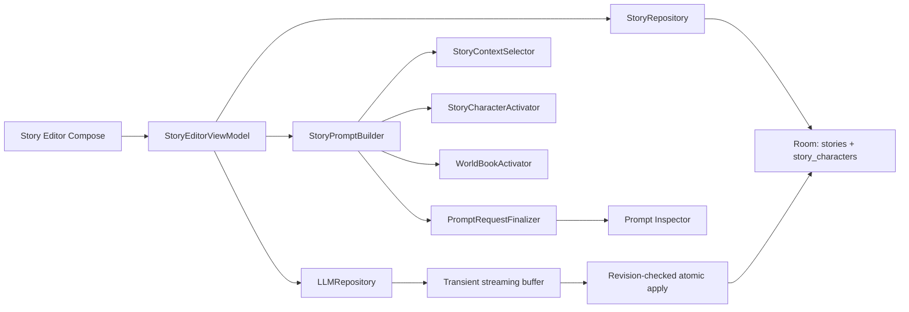

# RPClient 故事编写功能完整实现方案

> 状态：基于 NovelAI 官方实现重新收敛后的设计方案
> 日期：2026-08-05
> 范围：在现有单聊、群聊之外，增加独立的连续文档式 AI 写作功能。

## 1. 结论

RPClient 的故事功能采用“一个 Story 对应一个连续文档”的模型。章节通过正文中的标题和分隔符表达。V1 的 AI 生成仅围绕文档末尾正文、长期记忆、作者备注、角色卡、命中的世界书和本次续写引导工作，例如：

```text
# 第一章 雨夜

正文……

***

# 第二章 来客

正文……
```

因此，V1 的一级结构调整为：

```text
RPClient
├── 单聊
├── 群聊
└── 故事
    ├── Story 列表
    ├── 连续正文编辑器
    ├── Memory
    ├── Author's Note
    ├── Character References
    ├── Lorebook
    ├── AI 续写、撤销与恢复
    └── Prompt Inspector
```

核心工程约束：

1. 故事正文持久化在独立的 `Story.content`。
2. 章节标题和分隔符直接保存在 `Story.content`，正文始终只有一个事实来源。
3. AI 生成期间 V1 暂时锁定正文编辑，生成完成后原子插入或替换，避免并发编辑链路膨胀。
4. 每次 AI 应用仍检查 Story revision 和目标文本哈希，防止生命周期切换或异常状态覆盖新正文。
5. 长篇上下文由 Memory、Author's Note、角色卡、Lorebook 和局部正文窗口组成。

## 2. NovelAI 官方实现调研

### 2.1 Story 是连续文档

NovelAI 的 Editor 让用户直接在一个连续编辑区中写作，再通过 Send 或快捷键让 AI 继续生成。生成、用户输入和编辑进入 Undo、Redo、Retry 历史。

- [NovelAI Editor](https://docs.novelai.net/en/text/editor/)

NovelAI 的 Document API 将文档拆成 `Section`，官方明确说明 Section 当前代表段落，`section` 与 `paragraph` 可以互换使用。Section 是长文编辑和历史跟踪使用的内部段落块。

- [NovelAI Document API](https://docs.novelai.net/en/scripting/document-api/)

Editor V2 对长故事采用动态加载 Section 的方式改善性能。这里的 Section 仍是内部段落块，说明“长文性能分块”和“用户章节结构”应当分开设计。

### 2.2 章节由用户写入正文

NovelAI 将 `***` 作为场景或章节分隔符，也允许用户把带空格的方括号文本用作章节标题。这些标记都直接存在于正文中。

- [NovelAI Special Symbols](https://docs.novelai.net/en/text/specialsymbols/)

RPClient 采用相同原则：用户直接输入章节标题和分隔符，编辑器按原文保存。

### 2.3 Story Settings 上下文

NovelAI 的主要长期引导能力是：

- Memory：保存需要模型长期记住的设定、人物状态和已发生事件，且完全可选。
- Author's Note：靠近最新正文插入，用短指令强烈影响下一次生成。
- Lorebook：按关键词激活人物、地点、物品和世界设定。
- Context Viewer：显示正文、Memory、Author's Note 和 Lorebook 最终如何进入上下文。

参考：

- [NovelAI Story Settings](https://docs.novelai.net/en/text/editor/storysettings/)
- [NovelAI Lorebook](https://docs.novelai.net/en/text/lorebook/)
- [NovelAI Advanced Settings and Context Viewer](https://docs.novelai.net/en/text/editor/advancedsettings/)

Memory 保存需要长期进入上下文的设定、大纲和未来计划。Story Summary 保存当前剧情摘要；
用户可手动触发 AI，使用 Memory、当前摘要和按常规上下文规则裁剪的正文生成替换内容，确认后覆盖保存；两者分别
进入写作 Prompt，避免自动摘要覆盖用户规划。

### 2.4 V1 仅保留文档末尾续写

NovelAI 的 Writer's Toolbox 提供 Rewrite、Transform、Expand、Condense 和 Custom，但这些选区操作不进入 RPClient V1，仅作为后续版本调研参考。

- [NovelAI Writer's Toolbox](https://docs.novelai.net/en/text/editor/writerstoolbox/)

RPClient V1 面向通用 LLM Provider：普通续写始终作用于文档末尾，文中修改由用户直接编辑正文完成。

## 3. 实现范围

V1 实现以下完整能力：

- Story 新建、打开、重命名和删除。
- 单个连续纯文本或 Markdown 正文编辑器。
- 自动保存、保存状态和失败重试。
- Memory 和 Author's Note。
- 为当前 Story 关联 0～N 张角色卡，并配置常驻/自动匹配模式与 Story 专用别名。
- 选择当前 Story 启用的世界书条目。
- 文档末尾续写。
- 可选的一次性续写引导；非空时用可在系统提示词页编辑的 `{{guidance}}` 模板包裹为 System 消息，插入正文上下文与最终续写 User 任务之间。
- 流式生成、停止，以及会话内的撤销与恢复。
- Prompt Inspector。
- TXT/Markdown 导入导出。
- RPClient Story JSON 完整备份和恢复。
- 数据库迁移、单元测试、Room 集成测试和关键 UI 流程测试。

## 4. 总体架构



### 4.1 可直接复用的现有能力

| 现有能力 | 故事功能中的复用方式 |
|---|---|
| `LLMRepository` | 复用非流式和流式模型调用、取消与错误分类 |
| `PromptRequestFinalizer` | 复用 Token 统计、上下文预算、协议后处理和检查快照 |
| `WorldBookActivator` | 使用通用 `WorldBookScanContext` 激活世界书 |
| `PromptInspectorDialog` | 增加少量故事来源类型后复用 |
| Provider 和模型设置 | 故事生成使用当前全局 Provider |
| `ChatArchiveRepository` 的流程 | Story 归档沿用“解析—预览—事务写入”工作流 |

相关代码：

- [`LLMRepository.kt`](../app/src/main/java/me/kafuuneko/rpclient/libs/room/repository/LLMRepository.kt)
- [`PromptRequestFinalizer.kt`](../app/src/main/java/me/kafuuneko/rpclient/libs/prompt/PromptRequestFinalizer.kt)
- [`WorldBookActivator.kt`](../app/src/main/java/me/kafuuneko/rpclient/libs/prompt/WorldBookActivator.kt)
- [`PromptInspectorDialog.kt`](../app/src/main/java/me/kafuuneko/rpclient/ui/widgets/PromptInspectorDialog.kt)
- [`ChatArchiveRepository.kt`](../app/src/main/java/me/kafuuneko/rpclient/libs/chat/ChatArchiveRepository.kt)

### 4.2 故事 Prompt Builder

`StoryPromptBuilder` 面向连续文档末尾构建续写请求，复用世界书、Tokenizer、最终化和 LLM 能力。正文持久化、来源跟踪和自动保存均围绕 `Story.content` 工作。

## 5. Room 数据模型

V1 新增一个正文实体和一个角色卡关联实体。

### 5.1 Story

```kotlin
@Entity(tableName = "stories")
data class Story(
    @PrimaryKey(autoGenerate = true)
    val id: Long = 0L,
    val title: String,
    val content: String = "",
    val memory: String = "",
    val authorNote: String = "",
    val lorebookEntrySet: String = "[]",
    val worldInfoStateJson: String = "{}",
    val worldInfoGenerationStep: Int = 0,
    val contentRevision: Long = 0L,
    val createTime: Long,
    val latestTime: Long
)
```

字段语义：

- `title`：只用于列表、搜索和导出文件名，不自动注入 Prompt。
- `content`：完整连续正文，是章节标题和正文内容的唯一事实来源。
- `memory`：用户维护的长期剧情记忆，也可放置大纲、人物现状和未解决事项。
- `authorNote`：影响下一次生成的短期指令，可包含文风、视角、时态和下一幕方向。
- `lorebookEntrySet`：沿用现有 JSON ID 集合保存显式启用的世界书条目。
- `worldInfoStateJson`：沿用 sticky/cooldown 等世界书时序状态。
- `worldInfoGenerationStep`：仅统计已经实际应用到正文的 AI 生成次数，映射世界书的时序步数。
- `contentRevision`：每次正文成功落库递增，用于自动保存和 AI 应用的乐观锁。

### 5.2 StoryCharacter

```kotlin
@Entity(
    tableName = "story_characters",
    primaryKeys = ["storyId", "characterId"],
    foreignKeys = [
        ForeignKey(
            entity = Story::class,
            parentColumns = ["id"],
            childColumns = ["storyId"],
            onDelete = ForeignKey.CASCADE
        ),
        ForeignKey(
            entity = Character::class,
            parentColumns = ["id"],
            childColumns = ["characterId"],
            onDelete = ForeignKey.CASCADE
        )
    ],
    indices = [Index("characterId")]
)
data class StoryCharacter(
    val storyId: Long,
    val characterId: Long,
    val sortOrder: Int,
    val activationMode: Int = ACTIVATION_AUTO,
    val activationKeysJson: String = "[]"
) {
    companion object {
        const val ACTIVATION_ALWAYS = 0
        const val ACTIVATION_AUTO = 1
    }
}
```

规则：

- 关联表示这张角色卡属于当前 Story 的候选人物参考集。
- V1 每次构建 Prompt 时读取角色卡实时内容。
- 删除 Story 只级联删除关联；不会删除角色卡。
- 删除角色卡只级联删除关联；不会删除 Story 或正文。
- `sortOrder` 同时用于设置页显示和多角色同时激活时的稳定注入顺序。
- `ACTIVATION_ALWAYS` 用于主角、当前 POV 人物等每轮必需人物。
- `ACTIVATION_AUTO` 根据当前操作附近正文中的名称和别名动态激活，适合配角。
- `activationKeysJson` 保存当前 Story 专用别名，不修改全局角色卡；角色名称始终是隐式激活键。
- Auto 使用角色名称和 Story 别名进行字面匹配；主要人物由用户设为 Always。

## 6. 数据库升级

当前开发版本的 `AppDatabase` version 3 尚未发布。`Story` 和 `StoryCharacter` 直接并入
version 3 的最终 schema，对外只需要保证已发布 version 2 可以无损迁移到 version 3：

```kotlin
@Database(
    entities = [
        // existing entities,
        Story::class,
        StoryCharacter::class
    ],
    version = 3,
    autoMigrations = [
        AutoMigration(from = 1, to = 2, spec = AppDatabaseAutoMigration1To2Spec::class),
        AutoMigration(from = 2, to = 3)
    ],
    exportSchema = true
)
```

同时需要：

- 注册 `Story::class` 和 `StoryCharacter::class`。
- 暴露 `StoryDao` 和 `StoryCharacterDao`。
- 重新生成包含 Story 表的 `app/schemas/.../3.json`。
- 扩展 2 → 3 migration 集成测试，验证 Regex 与 Story 表同时建立。
- 验证既有角色、世界书、单聊、群聊和 Regex 数据均保留。
- 不使用 destructive migration。

## 7. DAO 与 Repository

新增：

```text
libs/room/entity/Story.kt
libs/room/entity/StoryCharacter.kt
libs/room/dao/StoryDao.kt
libs/room/dao/StoryCharacterDao.kt
libs/room/repository/StoryRepository.kt
```

### 7.1 查询接口

```kotlin
suspend fun getStoryOverviews(): List<StoryOverview>
suspend fun getStory(id: Long): Story?
suspend fun getStoryCharacterCandidates(
    storyId: Long
): List<StoryCharacterCandidate>
suspend fun createStory(title: String): Long
suspend fun renameStory(id: Long, title: String)
suspend fun updateStorySettings(
    id: Long,
    memory: String,
    authorNote: String,
    lorebookEntrySet: String
)
suspend fun replaceStoryCharacters(
    storyId: Long,
    selections: List<StoryCharacterSelection>
)
suspend fun deleteStory(id: Long)
```

`StoryOverview` 只包含：

```kotlin
data class StoryOverview(
    val id: Long,
    val title: String,
    val contentCharacterCount: Int,
    val preview: String,
    val latestTime: Long
)
```

列表查询只返回元数据，并使用 `LENGTH(content)` 和有限 `SUBSTR` 生成字符数与预览。

`replaceStoryCharacters` 在一个事务中校验角色 ID、删除旧关联并按传入顺序写入新关联，不能留下半更新状态。

```kotlin
data class StoryCharacterSelection(
    val characterId: Long,
    val activationMode: Int,
    val activationKeys: List<String>
)

data class StoryCharacterCandidate(
    val relation: StoryCharacter,
    val character: Character
)
```

Repository 读取候选时按 `sortOrder` 排序，并把损坏的别名 JSON 视为空列表；不因单条损坏数据阻止 Story 打开。

### 7.2 自动保存

正文更新携带期望 revision：

```sql
UPDATE stories
SET content = :content,
    contentRevision = contentRevision + 1,
    latestTime = :latestTime
WHERE id = :storyId
  AND contentRevision = :expectedRevision
```

返回值：

- 更新 1 行：保存成功，ViewModel 接收新 revision。
- 更新 0 行：Story 已在其他状态路径发生变化；不得覆盖数据库正文，进入冲突状态并保留当前草稿供复制。

### 7.3 AI 结果应用

```kotlin
data class StoryGeneratedEdit(
    val storyId: Long,
    val baseRevision: Long,
    val start: Int,
    val end: Int,
    val originalTextHash: String,
    val result: String,
    val nextWorldInfoStateJson: String
)
```

一次 AI 应用在同一 Room 事务中：

1. 读取 Story 并检查 `contentRevision == baseRevision`。
2. 检查 `start/end` 合法且目标文本哈希一致。
3. 插入或替换正文目标范围。
4. 递增 `contentRevision` 和 `worldInfoGenerationStep`。
5. 提交预算裁剪后的 `nextWorldInfoStateJson`。
6. 更新 `latestTime`。
7. 返回新正文和 revision。

任何检查失败都不能修改正文或世界书状态。

## 8. 页面与导航

V1 使用 Story 列表和编辑器；新建操作由列表中的标题对话框完成：

```text
feature/story/
├── list/
│   ├── StoryListActivity.kt
│   ├── StoryListViewModel.kt
│   ├── presentation/
│   └── ui/StoryListLayout.kt
└── editor/
    ├── StoryEditorActivity.kt
    ├── StoryEditorViewModel.kt
    ├── presentation/
    ├── model/
    └── ui/StoryEditorLayout.kt
```

首页的“故事创作”入口打开 Story 列表，Story 管理操作集中在列表页面。

Story 列表提供：

- 标题、字符数、短预览和更新时间。
- 新建 Story：弹出标题对话框，创建后直接打开编辑器。
- 重命名和删除。
- 空列表引导。

### 8.1 编辑器布局

```text
TopBar
├── 返回
├── Story 标题
├── 保存状态
└── 更多

Editor
└── TextFieldState + BasicTextField

Bottom Bar
├── 字符数
├── 可选续写引导输入
├── 撤销 / 恢复 / 续写 / 停止
├── Memory / Author's Note
└── Characters / Lorebook / Prompt Inspector
```

正文中的标题、空行、`***` 和 Markdown 均按用户输入原样保存。

Story 设置中的角色卡列表提供：

- 添加和移除候选角色卡。
- 在 Always 和 Auto 之间切换。
- 编辑仅对当前 Story 生效的激活别名。
- 调整稳定注入顺序。
- 显示角色卡绑定的世界书名称；选择角色时默认勾选该世界书，之后允许用户显式关闭。

## 9. 编辑器状态与自动保存

项目当前 Compose Foundation 已具备状态式文本输入 API。V1 使用 `TextFieldState + BasicTextField`。

状态分工：

- Compose 持有 `TextFieldState`，负责正文、光标、选区和 IME composition。
- ViewModel 持有 Story 元数据、当前 revision、dirty、保存状态和生成状态。
- Room 是正文的最终持久化权威。
- Compose 使用 `snapshotFlow` 把文本和选区快照发送给 ViewModel。
- ViewModel 使用约 500–750ms debounce 自动保存。
- 返回、开始生成、打开导出和进入后台前强制 flush。

不要把完整正文放入 `rememberSaveable` 或 Activity Bundle。Bundle 只保存 Story ID 和必要的小型导航状态；正文由 ViewModel 和 Room 恢复。

```kotlin
sealed class StorySaveState {
    data object Saved : StorySaveState()
    data object Dirty : StorySaveState()
    data object Saving : StorySaveState()
    data class Failed(val message: String) : StorySaveState()
    data class Conflict(val draft: String) : StorySaveState()
}
```

### 9.1 会话内多步 Undo

V1 在本次编辑器会话内保留最多 50 次连续 AI 应用：

```kotlin
data class StoryUndoEntry(
    val start: Int,
    val insertedText: String,
    val replacedText: String,
    val previousWorldInfoStateJson: String,
    val previousWorldInfoGenerationStep: Int,
    val nextWorldInfoStateJson: String
)
```

Undo 和 Redo 分别使用栈按时间顺序移动条目。每次操作使用 Story 当前 revision，
并继续通过目标文本哈希检查后原子更新正文和世界书状态。新的 AI 结果会清空 Redo 栈；
用户手动编辑正文会清空两个栈。历史只保存在当前编辑器会话中，应用重启后从 Room 恢复最新正文。

## 10. AI 操作与生成流程

### 10.1 V1 操作

| 操作 | 前置条件 | 应用方式 |
|---|---|---|
| 续写 | 正文可编辑；引导文本可为空 | 无论当前光标位置，始终在文档末尾插入；非空引导仅影响本次请求 |
| 撤销 | 本会话仍有可撤销的连续 AI 续写 | 按时间逆序原子移除 AI 文本并恢复对应世界书状态 |
| 恢复 | 本会话仍有已撤销且未被新修改截断的 AI 续写 | 按原顺序重新应用文本和对应世界书状态，不重新请求模型 |

### 10.2 生成状态

```kotlin
sealed class StoryGenerationState {
    data object Idle : StoryGenerationState()

    data class Streaming(
        val partialText: String
    ) : StoryGenerationState()

    data object Applying : StoryGenerationState()

    data class Failed(
        val message: String,
        val recoverablePartial: String = ""
    ) : StoryGenerationState()
}
```

成功输出自动原子应用到正文，并提供撤销/恢复。

### 10.3 标准流程

1. 验证操作前置条件。
2. 强制保存当前正文。
3. 捕获 revision、文档末尾目标和原文哈希。
4. 构建 Prompt Inspection 快照和世界书下一状态候选。
5. 暂时锁定正文编辑，只保留停止按钮。
6. 流式内容先进入 ViewModel 临时缓冲区，不逐 Token 写 Room。
7. 成功完成后在单次事务中应用正文。
8. 记录一条会话内 Undo 信息。
9. 更新编辑器正文、光标和 revision，恢复编辑。

生成期间锁定正文，保证目标范围在生成完成前保持稳定；应用事务仍执行 revision 和原文哈希检查。

### 10.4 停止和失败

- 用户主动停止且已有 partial：把 partial 作为本次结果原子应用，并允许撤销/恢复。
- 用户主动停止且无内容：回到 Idle。
- Provider 失败且有 partial：不自动写正文，显示“插入部分结果、复制、丢弃”。
- Provider 失败且无内容：显示错误并回到可编辑状态。
- AI 应用冲突：保留生成文本供复制，不修改正文和世界书状态。

## 11. Prompt 与上下文

### 11.1 Prompt 输入

```kotlin
data class StoryPromptContext(
    val story: Story,
    val characterCandidates: List<StoryCharacterCandidate>,
    val target: StoryEditTarget,
    val sourceContent: String,
    val provider: LLMProvider,
    val candidateLorebookEntries: List<LorebookEntry>,
    val candidateLorebooks: Map<Long, Lorebook>,
    val recursiveScanningLorebookIds: Set<Long>
)
```

`characterCandidates` 是 Story 关联的全部候选角色；本轮实际注入集合由 `StoryCharacterActivator` 计算。

### 11.2 Prompt 结构

```text
System：故事写作主提示词
System：Memory
System：Before Character 世界书
System：本轮激活的角色卡人物参考
System：After Character 世界书
System：AN Top 世界书
System：Author's Note
System：AN Bottom 世界书
User/System：目标附近的正文窗口和 At Depth 世界书
System：本次续写引导（非空时）
User：本次任务
```

主提示词约束模型：

- 只输出可直接进入正文的内容。
- 不解释修改过程，不复述任务。
- 不输出“下面是改写结果”等前言。
- 不使用 Markdown 代码围栏包装正文。
- 保持输入文本使用的语言和叙述风格。

### 11.3 上下文优先级

| 内容 | 是否可裁剪 | 优先级 |
|---|---:|---:|
| 写作任务 | 否 | 最高 |
| 文档末尾的最近正文 | 至少保留一块 | 很高 |
| Author's Note | 否 | 很高 |
| Always 角色卡 | 否 | 很高 |
| Auto 命中的角色卡 | 否 | 很高 |
| 命中的世界书 | 按世界书预算 | 高 |
| Memory | 否 | 中高 |
| 距离目标较远的正文 | 是 | 最低 |

如果 Memory 或本轮激活角色卡本身使不可裁剪内容超过预算，应明确阻止请求并列出占用最大的角色卡，不能静默丢弃人物设定。

### 11.4 两阶段上下文构建

角色卡和世界书先使用固定范围文本完成激活，再执行最终预算编排。每次生成分成两个阶段：

```text
阶段一：匹配
确定操作目标
→ 构建固定范围的 Activation Scan Text
→ 激活 Always/Auto 角色卡
→ 激活世界书
→ 得到本轮角色与世界书集合

阶段二：编排
预留输出 Token
→ 按优先级选择最终正文窗口
→ 组装 Memory、角色卡、世界书、Author's Note 和正文
→ PromptRequestFinalizer 后处理与裁剪
→ 生成 Prompt Inspection
```

`Activation Scan Text` 只用于匹配，不单独持久化，也不保证全部发送给模型。它包含：

- 文档末尾最近固定数量的段落。
- Author's Note。
- 本次续写引导。

匹配文本由上述四类内容组成。Memory 仅作为最终生成上下文参与编排。匹配阶段使用固定字符/段落范围，保证角色激活结果不受最终 Token 裁剪影响。

### 11.5 正文窗口算法

1. 将正文按段落切块；这只是 Prompt 构建时的临时块，不是数据库章节。
2. 超长单段按 Token 预算继续切分。
3. 续写从文档末尾向前选择最近段落。
4. 优先保留距离文档末尾最近的块，再逐步向前扩展。
5. 每个块携带来源和距离优先级。
6. 最终交给 `PromptRequestFinalizer` 做协议后处理和预算确认。
7. 不发送整个 Story，除非全文本身能够在保留输出预算后完整放入上下文。

### 11.6 角色卡

角色卡与世界书承担不同职责：角色关联形成候选人物集，Always 与本轮命中的 Auto 角色才进入 Prompt；世界书适合按正文关键词激活大量次要人物、地点、物品和设定。

角色激活算法：

```text
Story 关联角色
├── Always → 直接激活
└── Auto
    ├── Character.name 命中 → 激活
    ├── activationKeysJson 任一别名命中 → 激活
    └── 未命中 → 不注入
```

匹配规则：

- 默认忽略大小写并对键两端空白归一化。
- 英文等有明确单词边界的单段名称按完整单词匹配。
- 中文、日文等不依赖空格分词的名称和别名按普通子串匹配。
- 激活器只执行确定性的名称和别名字面匹配。
- 同一轮命中多个角色时全部激活，并按 `sortOrder` 注入。
- 每个角色独立生成 `PromptMessageDraft` 和 `PromptSource(referenceId = characterId)`，保留可解释来源。

激活器返回结构化原因，供 Prompt Builder 和 Inspector 共用：

```kotlin
enum class StoryCharacterActivationReason {
    Always,
    Name,
    Alias
}

data class ActiveStoryCharacter(
    val candidate: StoryCharacterCandidate,
    val reason: StoryCharacterActivationReason,
    val matchedKey: String? = null
)
```

同一角色即使命中多个键也只出现一次，原因优先级为 `Always > Name > Alias`，`matchedKey` 仅用于人类可读的检查信息。

V1 注入角色卡字段：

- `name`
- `description`
- `personality`
- `scenario`

只有上述四个字段参与故事 Prompt。故事主指令始终来自 `StoryMain`。人物参考使用固定格式构建：

```text
[Character Reference]
Name: Alice
Description: ...
Personality: ...
Scenario: ...
```

选择 Story 角色时，角色的 `characterLorebookId` 会把对应世界书条目默认加入显式选择；用户之后可以按整本或单条关闭。保存后的 `lorebookEntrySet` 是重新加载设置和构建 Prompt 时的唯一启用依据，避免角色关联覆盖用户的关闭操作。

### 11.7 世界书

世界书候选条目来自 Story 显式选择并保存的世界书条目。角色卡通过 `characterLorebookId` 绑定的世界书只在选择角色时提供默认勾选，不绕过 Story 的世界书开关。

默认关键词扫描源仅包含文档末尾最近正文窗口。条目显式设置 `matchCharacterDescription`、`matchCharacterPersonality`、`matchScenario` 等开关时，再把本轮已激活角色卡的对应字段合并到现有 `WorldBookScanContext` 静态扫描源。

故事操作映射到现有 `WorldBookGenerationType`：

| 故事操作 | 世界书生成类型 |
|---|---|
| 续写 | `Continue` |

使用 `worldInfoGenerationStep + 1` 作为本次激活的时序位置。结果实际写入正文时递增 generation step 并提交预算裁剪后的下一状态；失败、复制和丢弃部分结果保持当前状态。

位置兼容映射：

```text
Memory
→ Before Character
→ Character References
→ After Character
→ AN Top
→ Author's Note
→ AN Bottom
→ Example Before/After（无示例区时放在正文窗口之前）
→ 最近正文（按段落插入 At Depth）
→ 本次续写引导 System 指令（仅普通续写且非空）
→ 本次任务
```

`At Depth.depth` 解释为距离正文末尾的段落数。`Outlet` 在模板显式引用时注入；位置表是故事连续文档的兼容映射。

### 11.8 动态上下文窗口

`StoryContextSelector + StoryPromptBuilder` 在每次请求时根据文档末尾、Provider Context Limit 和输出预留动态构建上下文。上下文仅存在于本次请求内存和 Prompt Inspection 快照中。编辑器的“查看上下文”入口复用 Prompt Inspector，显示最近一次请求或按当前文档末尾试构建的结果。

### 11.9 Prompt Inspector

扩充 `PromptSourceKind`：

```kotlin
StoryMainPrompt,
StoryMemory,
StoryAuthorNote,
StoryCharacter,
StoryDocumentContext,
StoryContinuationGuidance,
StoryTask
```

世界书继续使用现有 `WorldInfo` 来源。Inspector 应能说明：

- 哪些正文段落进入了上下文。
- 哪些角色卡因 Always、名称或哪个别名被激活，以及哪些允许字段进入了上下文。
- 哪些世界书被激活和保留。
- 远端正文是否因预算被裁剪，以及不可裁剪内容是否导致预算错误。
- 续写任务实际消耗了多少 Token。
- 模型最终收到的消息顺序和角色。

## 12. Prompt 预设与全局设置

V1 新增三个故事 Prompt 预设。`StoryMain` 和非空的 `StoryContinuationGuidance` 使用 System 角色；`StoryContinue` 作为 User 任务放在上下文末尾，防止任务指令被远端正文稀释。

```kotlin
const val DEFAULT_STORY_MAIN_PROMPT = """
You are a fiction-writing assistant editing a continuous manuscript.
Treat Story Memory, Character References, and Lorebook entries as factual constraints.
Follow the requested writing operation and return only prose that can directly replace or extend the manuscript.
Do not explain your work, repeat the task, or wrap the result in a code block.
Preserve the manuscript's language, narrative voice, tense, style, and established facts unless explicitly instructed otherwise.
"""

const val DEFAULT_STORY_CONTINUATION_GUIDANCE_PROMPT = """
Follow the user-provided continuation guidance below when writing the next passage.
Treat it as an instruction, not as manuscript text. Do not quote, repeat, explain, or mention the guidance in the output.

--- BEGIN CONTINUATION GUIDANCE ---
{{guidance}}
--- END CONTINUATION GUIDANCE ---
"""

const val DEFAULT_STORY_CONTINUE_PROMPT = """
Continue the manuscript immediately after its current ending.
Do not repeat or summarize existing text. Advance the current scene naturally and return only the continuation.
"""

```

在 `PromptType` 增加：

```kotlin
StoryMain,
StoryContinuationGuidance,
StoryContinue
```

`AppModel` 为三种预设分别增加 `stringPref`。续写引导预设支持 `{{guidance}}` 占位符；正文、Memory、角色卡和世界书由构建器分区注入。

角色格式由构建器固定生成；世界书格式继续复用现有 `WorldInfoFormat`。

## 13. 输出清理

新增保守的 `StoryOutputSanitizer`：

- 去除明确识别的 `<think>...</think>` 推理块。
- 如果整个响应只有一层 Markdown 代码围栏，则去除外围围栏。
- 去除完全匹配的“改写结果：”“续写如下：”等短前言。
- 不修改正文引号、段落缩进、破折号、人物名称和正文内部 Markdown。

## 14. 导入导出

### 14.1 TXT 与 Markdown

- TXT/Markdown 导入把整个文件作为一个 Story 的 `content`。
- 默认使用文件名作为标题，用户可以在确认页修改。
- 导出按原样写出完整 `content`。
- Markdown 与 TXT 共用同一正文导出逻辑，只改变建议扩展名和 MIME type。

### 14.2 RPClient Story 归档

建议扩展名：

```text
*.rpstory.json
```

结构：

```json
{
  "format": "rpclient_story",
  "version": 1,
  "story": {
    "title": "",
    "content": "",
    "memory": "",
    "authorNote": ""
  },
  "characterHints": [
    {
      "name": "",
      "fingerprint": "",
      "activationMode": "auto",
      "activationKeys": []
    }
  ],
  "lorebookHints": []
}
```

要求：

- 角色卡使用名称和内容 fingerprint 提示匹配；Hint 同时保存 `always/auto`、别名和数组顺序。
- 世界书只使用名称和内容 fingerprint 提示匹配。
- 无法唯一匹配的角色卡或世界书不自动关联。
- 解析阶段不写数据库，用户确认后在一个事务中创建 Story。
- 设置合理的最大导入大小，拒绝非法格式和未知主版本。
- 导入错误不展示完整私密正文、真实路径或堆栈。

## 15. UiState 与 UiIntent

### 15.1 UiState

```kotlin
sealed class StoryEditorUiState {
    data object None : StoryEditorUiState()

    data class Normal(
        val storyId: Long,
        val title: String,
        val memory: String,
        val authorNote: String,
        val saveState: StorySaveState,
        val generationState: StoryGenerationState,
        val storyCharacters: List<StoryCharacterState>,
        val enabledLorebookEntryIds: Set<Long>,
        val canUndoAiEdit: Boolean,
        val canRedoAiEdit: Boolean,
        val hasPromptInspection: Boolean,
        val dialogState: StoryDialogState
    ) : StoryEditorUiState()

    data class Finished(
        val previous: StoryEditorUiState
    ) : StoryEditorUiState()
}
```

```kotlin
data class StoryCharacterState(
    val characterId: Long,
    val name: String,
    val activationMode: Int,
    val activationKeys: List<String>,
    val sortOrder: Int,
    val linkedLorebookName: String? = null
)
```

完整正文和 `TextFieldState` 不复制进大型 immutable UiState；正文由 Compose 与 ViewModel 的专用编辑状态桥接。

### 15.2 主要 UiIntent

```text
Init
Resume
Back
EditorSnapshotChanged
FlushDraft
RenameStory
OpenStorySettings
SaveStorySettings
ToggleStoryCharacter
SetCharacterActivationMode
UpdateCharacterActivationKeys
MoveStoryCharacter
ToggleLorebookEntry
ContinueStory
StopGeneration
InsertRecoverablePartial
DiscardRecoverablePartial
UndoLastAiEdit
RedoLastAiEdit
OpenPromptInspector
ImportTextClick
ImportStoryClick
ExportTextClick
ExportStoryClick
DismissDialog
```

## 16. Koin 注册

在 `RPClientApp.kt` 注册：

```kotlin
singleOf(::StoryRepository)
singleOf(::StoryCharacterActivator)
singleOf(::StoryPromptBuilder)
singleOf(::StoryContextSelector)
singleOf(::StoryOutputSanitizer)
singleOf(::StoryArchiveCodec)
singleOf(::StoryArchiveRepository)
```

ViewModel 继续由 Activity 的 `viewModels()` 创建。

## 17. 文件改造清单

### 17.1 新增文件

```text
app/src/main/java/me/kafuuneko/rpclient/libs/room/entity/Story.kt
app/src/main/java/me/kafuuneko/rpclient/libs/room/entity/StoryCharacter.kt
app/src/main/java/me/kafuuneko/rpclient/libs/room/dao/StoryDao.kt
app/src/main/java/me/kafuuneko/rpclient/libs/room/dao/StoryCharacterDao.kt
app/src/main/java/me/kafuuneko/rpclient/libs/room/repository/StoryRepository.kt

app/src/main/java/me/kafuuneko/rpclient/libs/story/StoryPromptContext.kt
app/src/main/java/me/kafuuneko/rpclient/libs/story/StoryCharacterActivator.kt
app/src/main/java/me/kafuuneko/rpclient/libs/story/StoryPromptBuilder.kt
app/src/main/java/me/kafuuneko/rpclient/libs/story/StoryContextSelector.kt
app/src/main/java/me/kafuuneko/rpclient/libs/story/StoryOutputSanitizer.kt
app/src/main/java/me/kafuuneko/rpclient/libs/story/StoryArchiveModels.kt
app/src/main/java/me/kafuuneko/rpclient/libs/story/StoryArchiveCodec.kt
app/src/main/java/me/kafuuneko/rpclient/libs/story/StoryArchiveRepository.kt

app/src/main/java/me/kafuuneko/rpclient/feature/story/list/
app/src/main/java/me/kafuuneko/rpclient/feature/story/editor/
```

### 17.2 修改文件

```text
AppDatabase.kt
RPClientApp.kt
AppModel.kt
AndroidManifest.xml

feature/main/
feature/promptpreset/
libs/prompt/PromptInspection.kt
ui/widgets/PromptInspectorDialog.kt

res/values*/strings.xml
README.md
README_ZH.md
```

## 18. 测试矩阵

### 18.1 单元测试

- 文档末尾续写窗口选择。
- 超长单段分块。
- 中文、emoji、换行和 UTF-16 代理对的正文分块。
- 三种故事 Prompt 预设读取、编辑和生成任务映射正确。
- 角色卡注入字段严格等于 `name/description/personality/scenario`。
- Always 角色始终激活；Auto 角色可由名称和多个 Story 别名激活。
- 英文完整单词、CJK 子串、大小写和空白归一化匹配正确。
- Activation Scan Text 严格由文档末尾邻近正文、Author's Note 和本次续写引导组成，并独立于最终正文预算裁剪。
- 多个本轮激活角色按 `sortOrder` 稳定注入，过长时不被静默裁剪。
- 输出代码围栏、推理块和模型前言清理。
- 世界书关键词扫描源严格等于文档末尾邻近正文，角色静态扫描开关正确生效。
- 显式世界书和角色绑定世界书合并、激活、预算裁剪和时序状态推进。
- Prompt Inspector 来源和 omitted 记录。
- 空白续写引导不产生消息；非空引导以 System 角色发送，可编辑模板通过 `{{guidance}}` 注入引导文本，并且位于正文上下文与最终续写 User 任务之间。
- Story 归档编解码、未知版本和非法内容拒绝。

### 18.2 Room 集成测试

- 创建 Story 后正文、Memory 和 Author's Note 可持久化。
- Story 角色关联替换具有事务性，并完整保存顺序、模式和别名。
- 删除 Story 或角色卡只清理关联，不误删另一侧业务数据。
- 列表查询不返回完整正文。
- 自动保存 revision 成功和冲突。
- AI 插入成功并原子更新正文、revision 和世界书状态。
- AI 应用时 revision 已变化，不覆盖正文。
- AI 应用时文档末尾目标哈希不匹配，不覆盖正文。
- 删除 Story 不影响角色、世界书和聊天数据。
- 导入失败不留下半成品。
- 数据库 2 → 3 迁移保留所有既有数据，并建立 Regex 与 Story 存储。

### 18.3 UI 与流程测试

- 新建 Story 后直接进入编辑器。
- 选择、取消、重排角色卡以及修改模式/别名后，下一次 Prompt 使用最新配置。
- 返回和进入后台前正文完成保存。
- IME composition 期间不产生错误截断或重复保存。
- 无论当前光标位置如何，续写结果始终追加到文档末尾。
- 生成期间正文锁定且停止按钮可用。
- 启用流式传输时，partial 分片实时显示在正文目标位置，完成校验前不持久化。
- 成功生成自动插入并能撤销；撤销后可原样恢复，且不会重新请求模型。
- 续写成功后清空一次性引导；构建或 Provider 失败时保留。
- 停止生成保留 partial 并能 Undo。
- Provider 失败时 partial 不自动写正文。
- Activity 重建后从 ViewModel/Room 恢复正文。
- 小屏下键盘、工具栏和设置面板不遮挡当前输入位置。

## 19. 性能、隐私与安全

### 19.1 性能

- Story 列表只查询元数据、字符数和有限预览。
- 编辑器一次只加载当前 Story。
- 正文自动保存使用 debounce，不逐字符写 Room。
- 流式响应只更新临时缓冲区，完成或停止时单次写 Room。
- Prompt 按段落和 Token 预算选择正文窗口。
- 导入导出直接通过 URI 流读写，避免不必要的整份副本。
- 不在 Bundle、普通 UiState、Toast 或日志中保存完整正文。

上线前使用至少 100,000 个中文字符、2,000 个段落的测试文档检查输入、滚动、选区和自动保存。大文本基准未通过时，编辑器使用内部段落块和动态加载保证交互性能。

### 19.2 隐私与安全

- 正文默认保存在本地 Room。
- 只把当前 Prompt 实际需要的正文窗口、Memory、Author's Note、已选角色卡允许字段和激活世界书发送给用户配置的 Provider。
- Prompt Inspector 快照仅保存在 ViewModel 会话内。
- Debug Request Log 可能包含正文，继续沿用现有调试开关和隐私提示。
- 导入、导出必须由用户主动触发。
- 生成应用失败时宁可保留可复制结果，也不能覆盖新正文。
- 不在普通日志中输出正文、API Key、完整请求头和真实导入路径。

## 20. 实施顺序

本节是交给下一轮 AI 的执行顺序。应按阶段推进；每个阶段都必须完成对应实现和验证，不能只创建空类、占位接口或未接入页面。

### 阶段 1：Story 数据与连续编辑器

- `Story`、`StoryCharacter`、DAO、Repository。
- 数据库 version 3 最终 schema 和 2 → 3 migration 测试。
- Story 列表、新建、重命名和删除。
- 连续正文编辑器、自动保存、flush 和冲突处理。
- Story 设置中的角色卡与世界书选择。
- 首页故事入口。

阶段完成条件：数据迁移测试通过；Story CRUD、关联角色配置和正文自动保存形成可独立运行的闭环。

### 阶段 2：AI 写作与上下文

- `StoryCharacterActivator`、`StoryContextSelector` 和 `StoryPromptBuilder`。
- 两阶段角色/世界书匹配与最终上下文编排。
- 文档末尾续写。
- 流式缓冲、停止、原子应用、撤销和恢复。
- Memory、Author's Note、角色卡、世界书和 Prompt Inspector。
- 三种故事 Prompt 预设及设置页分组。
- 输出清理和主要单元测试。

阶段完成条件：续写、撤销和恢复可从真实编辑器触发；Prompt 可检查；生成成功、停止、失败和冲突路径均不会错误覆盖正文。

### 阶段 3：完整性与交付

- TXT/Markdown 导入导出。
- `.rpstory.json` 归档。
- 多语言资源和 README。
- UI、迁移、隐私和大文本性能测试。

阶段完成条件：本章测试矩阵和下一章验收标准全部满足；文档、字符串资源、数据库 schema 和导入导出格式与实际实现一致。

### 20.1 下一轮 AI 执行约束

- 开始实现前读取仓库中的 `AGENTS.md` 和现有架构，不假设文档中的文件状态已经落地。
- 保留工作区中与本功能无关的用户修改，不使用 destructive migration、`git reset --hard` 或覆盖式回退。
- 先复用现有 LLM、Prompt、世界书、归档和错误处理能力，再新增故事领域代码。
- 每完成一个阶段就运行与该阶段相关的单元测试、Room 集成测试和构建检查，并修复失败后再继续。
- 不以“已提供设计或代码骨架”作为完成；只有真实 UI、数据持久化、生成链路和测试闭环均接通后才进入验收。

## 21. 验收标准

V1 完成时必须满足：

1. 用户可以创建、重命名、打开和删除 Story，退出应用后正文仍然存在。
2. 正文是一个连续文档；用户可以自行输入章节标题和分隔符，系统不会拆分或重排。
3. 返回、进入后台和开始生成前不会丢失尚未保存的输入。
4. 用户可以为 Story 关联多张角色卡，并分别配置 Always、Auto、别名和顺序。
5. 一轮可以同时激活多张角色卡；Prompt 只注入 Always 和本轮名称/别名命中的 Auto 角色，并保持稳定顺序。
6. 显式选择和角色绑定的世界书能按正文关键词激活，不会因为 Memory 中提及名称而永久误激活。
7. 用户可以在文档末尾续写，并为单次续写提供可选引导。
8. AI 成功结果原子写入正文，并可以在当前编辑器会话内撤销和原样恢复。
9. 生成期间正文不可编辑；停止生成后的 partial 可以保留和撤销。
10. Provider 失败产生的 partial 不会未经用户选择自动进入正文。
11. 旧 revision 或错误文档末尾目标的 AI 结果不能覆盖新正文。
12. Prompt Inspector 能显示角色卡激活原因、Memory、Author's Note、世界书、正文窗口和预算裁剪结果。
13. 匹配窗口与最终 Prompt 分阶段构建，并使用 Provider 限制动态裁剪。
14. 可以导入导出 TXT/Markdown，并导出、重新导入 `.rpstory.json`。
15. 数据库升级不会破坏现有角色、世界书、单聊、群聊和 Regex 数据。

## 22. 最终建议

实施优先级：

```text
单 Story 连续文档
    → 可靠自动保存
    → AI 续写、撤销和恢复
    → Memory / Author's Note / Character References / Lorebook
    → Prompt Inspector
    → 基础导入导出
```

始终坚持五个边界：

1. 章节通过 `Story.content` 中的标题和分隔符表达。
2. `Story.content` 是正文的唯一事实来源。
3. 长文性能分块是编辑器内部实现细节。
4. AI 结果应用必须经过 revision 和目标文本检查，并在单次事务中提交正文与世界书状态。
5. Story 关联只定义角色候选集；只有 Always 和本轮明确命中的 Auto 角色进入 Prompt。
